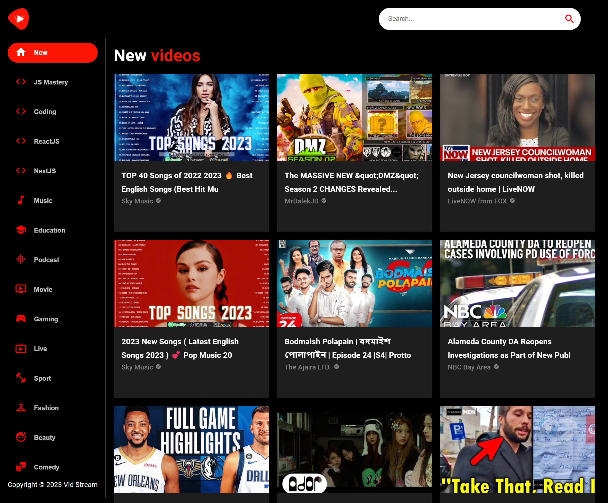

<h1 align="center"> Vid Stream - YouTube Clone </h1>

> Site is live at: https://vid-stream-gustavohdab.netlify.app/

  <a href="#-tecnologias">Tecnologias</a>&nbsp;&nbsp;&nbsp;|&nbsp;&nbsp;&nbsp;
  <a href="#-projeto">Projeto</a>&nbsp;&nbsp;&nbsp;&nbsp;&nbsp;&nbsp;</a>

## 💻 Projeto

O Vid Stream é um clone do YouTube desenvolvido com a API do RapidAPI, que oferece acesso a vídeos do YouTube. O projeto foi criado com o objetivo de praticar o consumo de API's externas e o desenvolvimento de um projeto com ReactJS.

## Funcionalidades:

- Pesquisar vídeos do YouTube
- Selecionar um vídeo para assistir
- Sidebar com vídeos relacionados ao vídeo selecionado
- Pesquisa pelas tags como Podcasts, Gaming, Playlists, Live, Beauty...

  

## 🚀 Tecnologias

Esse projeto foi desenvolvido com as seguintes tecnologias:

- [React](https://reactjs.org) - Biblioteca JavaScript para criar interfaces de usuário
- [JavaScript](https://www.javascript.com/) - Linguagem de programação
- [React Router Dom](https://reactrouter.com/web/guides/quick-start) - Biblioteca para gerenciar rotas no React
- [Material UI](https://material-ui.com/pt/) - Biblioteca de componentes React para um desenvolvimento ágil e fácil
- [Axios](https://axios-http.com/docs/intro) - Biblioteca para fazer requisições HTTP

---

Feito com ♥ by Gustavo Batista :wave: [LinkedIn](https://www.linkedin.com/in/gustavo-h-batista/) e [GitHub](https://github.com/gustavohdab)
